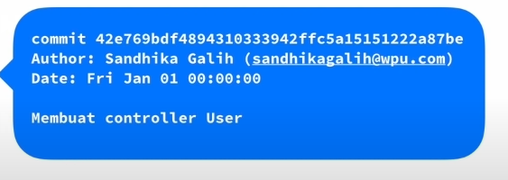

# First Video : What is git and github?
Github dan git yang mungkin dipakai secara terpisah dan juga dapat dipakai secara bersamaan.

## Version Control System
### What is Version Control System?
Version Control System, disebut juga <em> revision control system </em> atau <em> sourse code management </em> adalah sistem yang mengelola perubahan dari sebuah dokumen, program komputer, website dan kumpulan informasi lain.

### Why Should We Have Version Control System?
1. Dapat menyimpan "rekaman / <em>snapshot</em>" perubahan pada source code
2. Memungkinkan bekerja berkolaborasi dengan lebih baik
3. Mengetahui siapa uang melakukan dan kapan sebuah perubahan terjadi
4. Memungkinkan kita untuk kembali ke keadaan sebelum perubahan (<em>checkout</em>)

### Version Control System's Product
1. Git (yang akan dijelaskan pada rangkuman ini)
2. Subversion
3. Mercurial
4. CVS

## Git
### What is Git?
Git adalah sebuah <em>Version Control System</em> terdistribusi untuk mengelola perubahan file di dalam folder (<em>repository / repo</em>). Riwayat perubahan file disimpan menggunakan serangkaian <em><strong>commit</strong></em>.

### How Git Works?
1. Inisialisasi Project
2. Menambahkan view untuk login dan registrasi
3. Melakukan penyimpanan riwayat dengan commit
4. Apabila masih belum selesai, maka tahap ketiga akan dilakukan terus menerus
5. Project selesai, <em><strong>release version</strong></em>

### Commit Mechanism

1. Baris pertama merupakan kode hash untuk menyimpan version.
2. Baris kedua adalah nama dan account orang yang melakukan perubahan
3. Baris ketiga adalah waktu kapan terjadinya perubahan
4. Baris keempat adalah pesan commit

