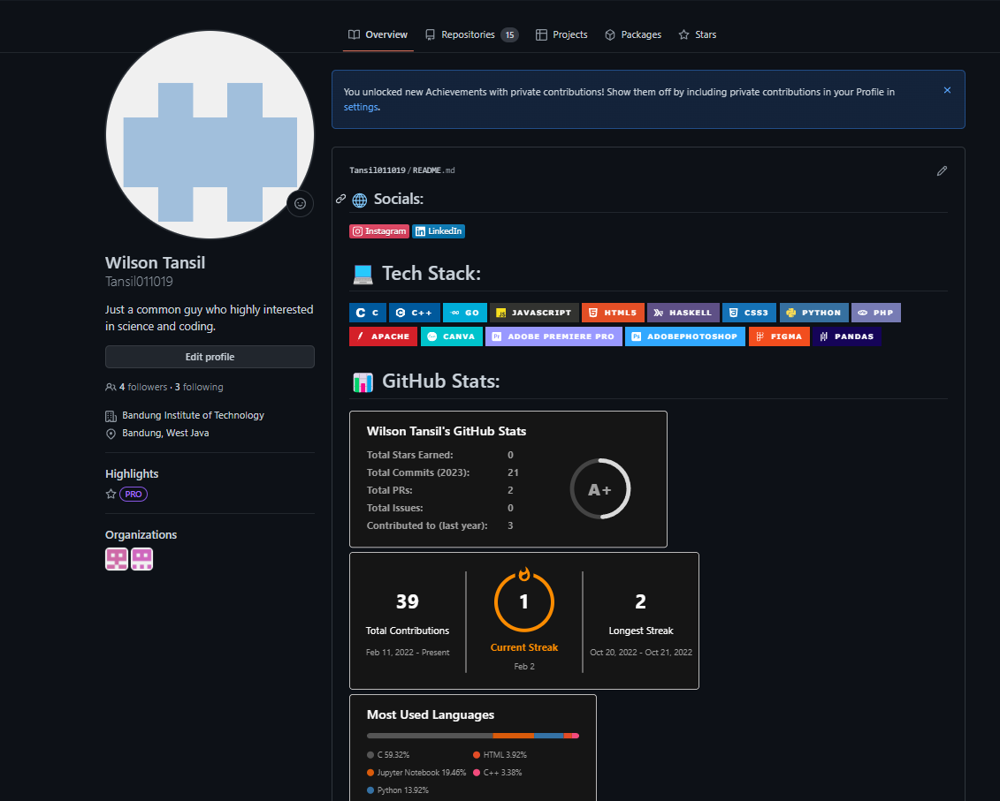
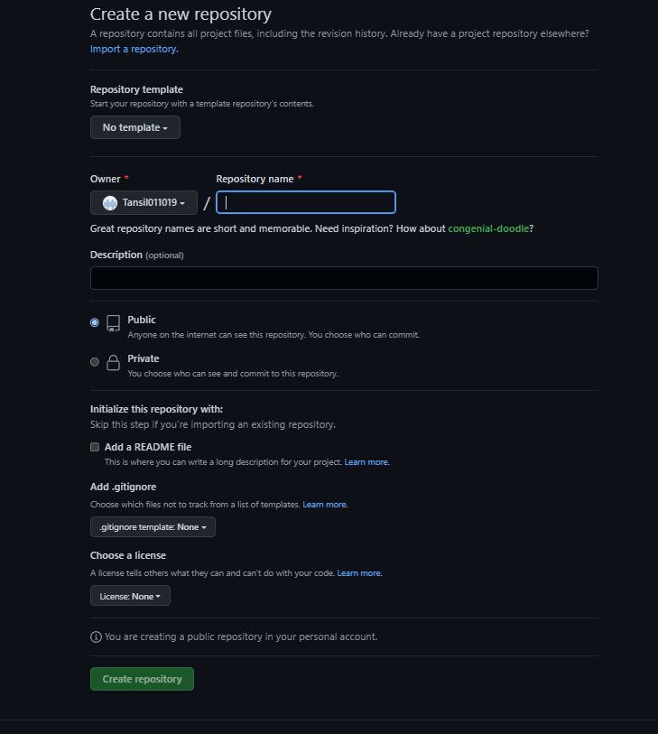
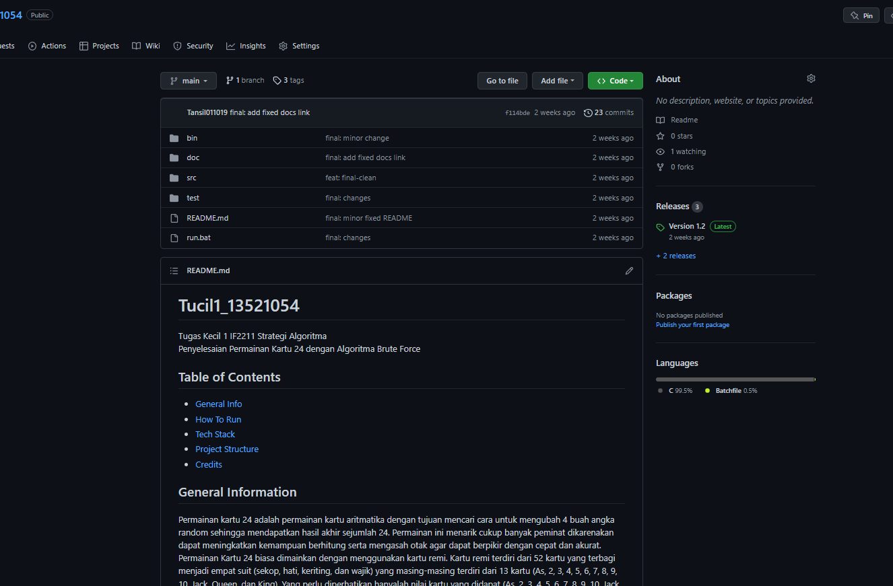

# Second Video : Bekerja Dengan GitHub
GitHub is a development platform inspired by the way you work. From <strong>open source</strong> to <strong>business</strong>, you can host and review code, manage project, and build software alongside 31 million developers.

## Step to Make an Account in GitHub
1. Open [GitHub](https://github.com) in a web browser, and then select <strong>Sign up</strong>.
2. Enter your email address.
3. Create a <strong>password</strong> for your new GitHub account, and <strong>Enter a username</strong>, too. Next, choose whether you want to receive updates and announcements via email, and then select <strong>Continue</strong>.
4. <strong>Verify your account</strong> by solving a puzzle. Select the Start Puzzle button to do so, and then follow the prompts.
5. After you verify your account, select the <strong>Create account</strong> button.
6. Next, GitHub sends a launch code to your email address. Type that launch code in the <strong>Enter code dialog</strong>, and then press <strong>Enter</strong>.
7. GitHub asks you some questions to help tailor your experience. Choose the answers that apply to you in the following dialogs.
8. On the <strong>Where teams collaborate</strong> and <strong>ship screen</strong>, you can choose whether you want to use the Free account or the Team account. To choose the Free account, select the <strong>Skip personalization</strong> button.

## Step to Make Repository
1. In the upper-right corner of any page, use the  drop-down menu, and select <strong>New repository</strong>.
2. Type a short, memorable name for your repository. For example, "hello-world".
3. Optionally, add a description of your repository. For example, "My first repository on GitHub."
4. Choose a repository visibility. Can be private and public.
5. Select Initialize this repository with a <strong>README</strong>.
6. Click <strong>Create repository</strong>.

## Documentation

> Already have an account, I will skip the part that required to signup.

> Page to create repository.

> My assignment repository