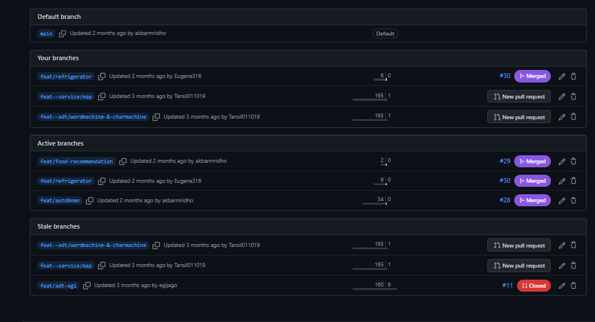
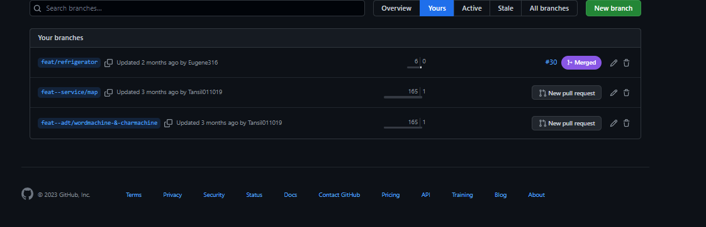

# Third Video : Branch
<em><strong>Branch</strong></em> diperlukan agar semua pekerjaan yang dilakukan tidak langsung merubah main program, serta lebih mudah untuk dilakukan kontrol terhadap error pada fitur tertentu.

## Table of Content
1. [Branching](#branching)
2. [Documentation](#documentation)

## Branching
- Membuat Git Branch
- Membuat snapshot tanpa mengganggu jalur utama (Master branch)
- Fitur experimental

## Documentation

> My last assignment branch

> The branch that I participated in