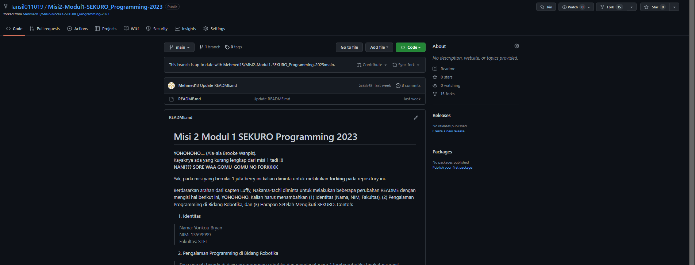

# Forth Video : Fork
Fork digunakan untuk menyalin repository milik orang lain ke dalam akun GitHub. Biasanya dilakukan dengan tujuan eksperimen pada project milik orang lain yang dianggap menarik.

## Table of Content
1. [Fork/Forking Function](#forkforking-function)
2. [Documentation](#documentation)

## Fork/Forking Function
1. Membuat "copy / duplikat" dari repo orang lain (beserta history-nya)
2. Jembatan antara repo original dan duplikatnya
3. Modifikasi terhadap repo original
4. Berkontribusi pada repo orang lain
5. Fork berbeda dengan clone. Fork mengcopy repo orang lain ke GitHub kita sedangkan clone mengcopy dari remote repo ke local repo

## Documentation

> Hasil Fork dari tugas kedua