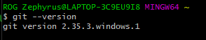

# Fifth Video : Bekerja dengan Git

## Table of Content
1. [Link Install Git](#link-install-git)
2. [My Git Version](#my-git-version)
3. [## 3 Area Pada Repo Git](#3-area-pada-repo-git)

## Link Install Git
Link : [https://git-scm.com/downloads](https://git-scm.com/downloads)

## My Git Version
To check `Git Version`
```shell
$ git --version
```


> My git version

## Git Command
```shell
$ git init
```
```shell
$ git add <file(s)>
```
```shell
$ git status
```
```shell
$ git commit
```
```shell
$ git config
```
```shell
$ git branch
```
```shell
$ git help
```
## 3 Area Pada Repo Git
1. Working tree
2. Staging Area
3. History